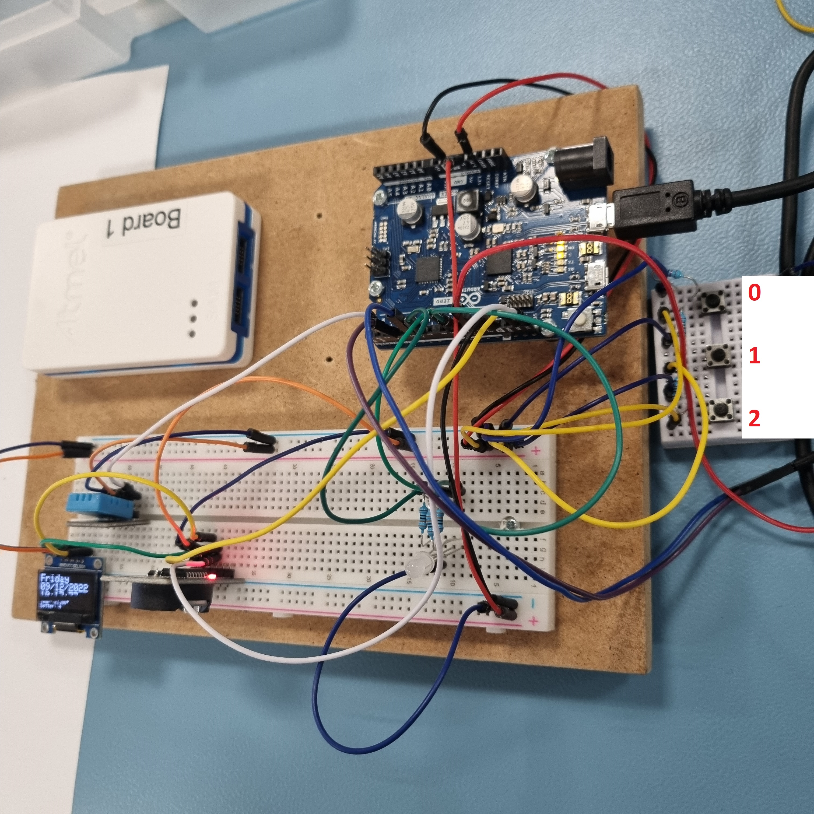

# README:

## Description:
Small setup that displays current Date and Time, as well as Temperature and Humidity, via OLED.
Using 3 small buttons, it is possible to customize the setup in various ways, namely:
- Button 0:
  - (1) Change the Page between DateTime + Temp OR Temp + Humidity
  - (2) Change the display between WHITE TEXT on BLACK, or BLACK TEXT on WHITE
- Button 1:
  - Change function sets, i.e. whether Button 0 and Button 2 uses (1) or (2) of their functions.
- Button 2:
  - (1) Increment time unit or reset time to match that of the connected computer
  - (2) Select time unit for incrementation (0 - 4)
    - 0 = Hour 
    - 1 = Minute 
    - 2 = Second 
    - 3 = N/A 
    - 4 = Reset to PC time
      - Note 3 is intentionally left blank to avoid accidental resets.

Note that setup includes sanity check by way of two separate components measuring temperature, albeit one with less granularity (DS3231) than the other (DHT11).
Setup includes a moderate level of styling, primarily meant to showcase what is possible on the OLED display.

## Setup:
- Pins used:
	- 2 (DHT)
  - 3, 5, 11 (Button switches)

- Components used:
  - DHT11 (Temperature and Humidity)
  - SSD1306 (OLED)
  - DS3231 (Time and Temperature)

- Global variables:
  - char daysOfTheWeek[7][12] = {"Sunday", "Monday", "Tuesday", "Wednesday", "Thursday", "Friday", "Saturday"};
  - int counter
    - Used to time switching of OLED display
  - int page
    - Toggle used to switch OLED display
  - int bg
    - Cycles display colorization options
  - int s2Function
    - Used for determining functino of 1st and 3rd button.

  - const int arrSwitch[]
    - Used to instantiate button switches
  - int arrState[]
    - Used to record button states
  
  - unsigned long lastBouce = 0;
  - unsigned long bounce = 50;

----
## Libraries:
- RTClib.h
- SPI.h
- Wire.h
- Adafruit_GFX.h
- Adafruit_SSD1306.h
- DHT.h
----
## Functions:
### readSwitch()
Interrupt used to read button presses.

### dhtCycle()
Writes (and formats) temperature and humidity data gathered from DHT on OLED display.

### rtcCycle()
Writes (and formats) datetime and temperature data gatheref from RTC on OLED display.

### checkLeadingZero(int value)
Checks if value is less than 10, and thus needs a leading 0, in terms of aesthetics.
