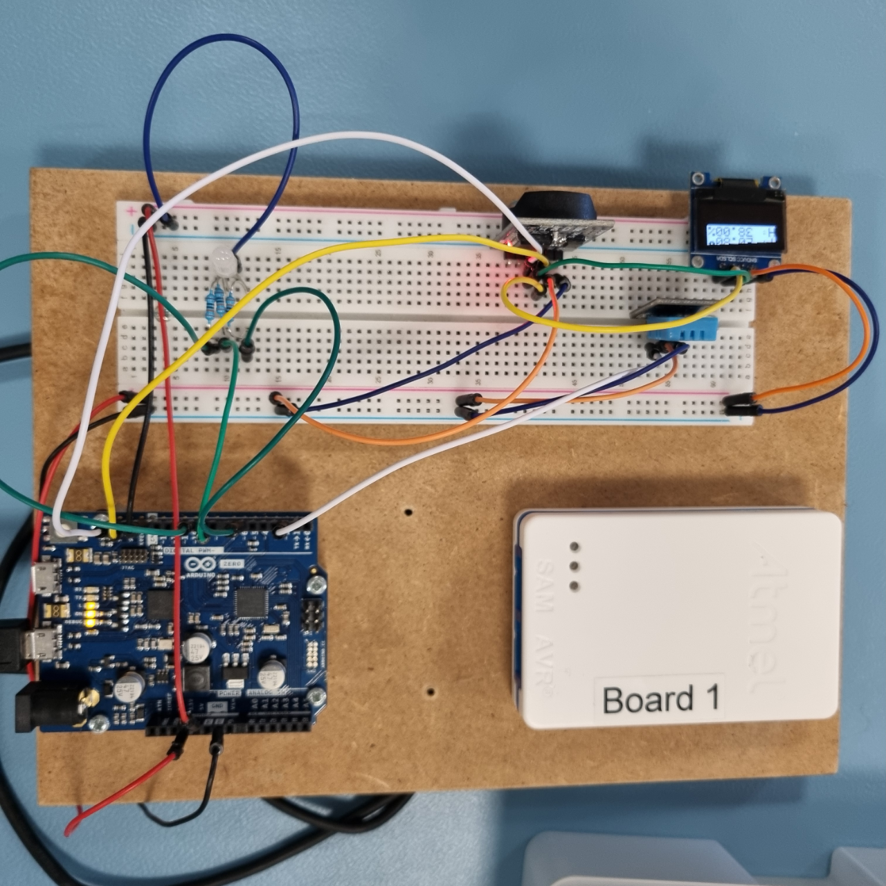

# README:

## Description:
Small setup that displays current Date and Time, as well as Temperature and Humidity, via OLED.
Note that setup includes sanity check by way of two separate components measuring temperature, albeit one with less granularity (DS3231) than the other (DHT11).
Setup includes a moderate level of styling, primarily meant to showcase what is possible on the OLED display.

## Setup:
- Pins used:
	- 2

- Components used:
  - DHT11 (Temperature and Humidity)
  - SSD1306 (OLED)
  - DS3231 (Time and Temperature)

- Global variables:
  - char daysOfTheWeek
  - int counter
  - int page
----
## Libraries:
- RTClib.h
- SPI.h
- Wire.h
- Adafruit_GFX.h
- Adafruit_SSD1306.h
- DHT.h
- Front/FreeSerif9pt7b.h (DEPRECATED)
----
## Functions:
### dhtCycle()
Writes (and formats) temperature and humidity data gathered from DHT on OLED display.

### rtcCycle()
Writes (and formats) datetime and temperature data gatheref from RTC on OLED display.

### checkLeadingZero(int value)
Checks if value is less than 10, and thus needs a leading 0, in terms of aesthetics.

----
## General runthrough:
Components and setup is initialized.
Loop clears OLED, and variable "page" flips when RTC returns a value of "second" where mod 3 == 0, thus changing between the 2 available readouts every 3 seconds.
The loop is on a 1 second (1000ms) delay().
OLED scrolls left to right, resetting each loop.